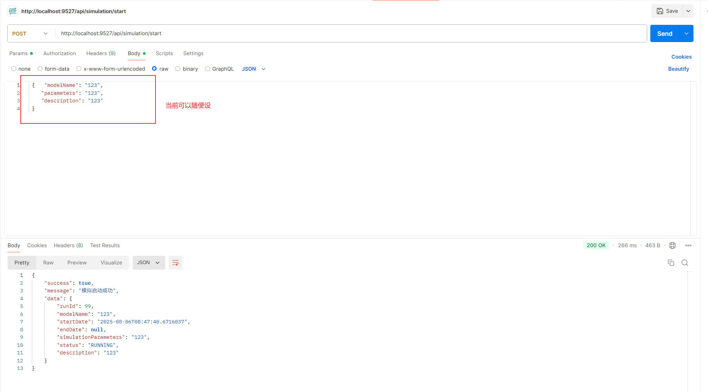

# 2025-08-06 现存问题：

## 还未实现端口号的获取

##  通过api启动仿真模型后，负责运行仿真模型的线程没有继续跑下去


控制台输出如下
```cmd
成功创建仿真运行记录，获取 run_id = 100
已收集 0 条行人数据到缓冲区。
simulTargetTime: 2025-05-31 18:30:00
columnCount: 40
Processing task: 南京-江西西南杆6HRG
2025-08-06T08:47:44.483+08:00 DEBUG 10696 --- [demo] [n-1754441260748] o.h.SQL                                  :
    select
        sr1_0.run_id,
        sr1_0.description,
        sr1_0.end_date,
        sr1_0.model_name,
        sr1_0.simulation_parameters,
        sr1_0.start_date,
        sr1_0.status
    from
        simulation_runs sr1_0
    where
        sr1_0.run_id=?
Hibernate:
    select
        sr1_0.run_id,
        sr1_0.description,
        sr1_0.end_date,
        sr1_0.model_name,
        sr1_0.simulation_parameters,
        sr1_0.start_date,
        sr1_0.status
    from
        simulation_runs sr1_0
    where
        sr1_0.run_id=?
2025-08-06T08:47:44.502+08:00 DEBUG 10696 --- [demo] [n-1754441260748] o.h.SQL                                  :
    update
        simulation_runs
    set
        description=?,
        end_date=?,
        model_name=?,
        simulation_parameters=?,
        start_date=?,
        status=?
    where
        run_id=?
Hibernate:
    update
        simulation_runs
    set
        description=?,
        end_date=?,
        model_name=?,
        simulation_parameters=?,
        start_date=?,
        status=?
    where
        run_id=?
Found closest record for 南京-江西西南杆6HRG with time difference: 1 seconds, in_count: 9, out_count: 4
Injected 9 pedestrians (in) to 南京-江西西南杆6HRG
Injected 4 pedestrians (out) to 南京-江西西南杆6HRG
Processing task: 南京-四川东北杆6HRG
Found closest record for 南京-四川东北杆6HRG with time difference: 2 seconds, in_count: 2, out_count: 4
Injected 2 pedestrians (in) to 南京-四川东北杆6HRG
Injected 4 pedestrians (out) to 南京-四川东北杆6HRG

```

如果可以正常运行下去，仿真模型会继续在控制台打印：
```
已收集 22 条行人数据到缓冲区。
已收集 24 条行人数据到缓冲区。
Pedestrian destination: forward
Pedestrian destination: forward
Pedestrian destination: leave
```


### 任务

分析为什么仿真模型没有继续运行下去


复现流程

1. 创建MySQL数据库，创建数据库的脚本在`docs/simulationpeds.sql`

2. 编译、运行项目
```cmd
.\mvnw.cmd clean compile
.\mvnw.cmd spring-boot:run
```

mvn spring-boot:run

3. 发送请求（可使用postman发送，也可编写测试单元启动）


